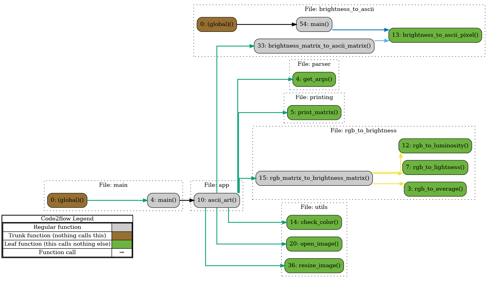

# ASCII ART
> create art like the Sumerians in 4000BCE

## Video Demo: <url>
## Description
This project is a Python application that generates ASCII art
based on user's input image. The application
supports various image formats, including high efficiency image formats(HEIF and HEIC).

## **System Flowchart**

> This flowchart was generated by using the package [code2flow](https://github.com/scottrogowski/code2flow)



## Architecture
### Entry point (main.py):
- initializes the application
- calls the "brain" of the application `app.py`
- you can compile the file without "python" arg in the terminal `(./main [args])`

### "Brains" of the application (app.py)
- manages the pipeline of the application:
    - parsing arguments
    - image loading
    - image resizing
    - rgb to brightness conversion
    - brightness to ascii conversion
    - printing with custom colours

### Command line arguments
- positional argument: **input image path**
- optional arguments:

| Argument Type   | Argument Name      | Short Description         | Possible Values                                 |
|-----------------|-------------------|--------------------------|-------------------------------------------------|
| Positional      | image_path        | Image path               | Any valid image file path (e.g. `bear.png`)     |
| Optional        | --rgb-filter      | RGB filter algorithm     | `average`, `lightness`, `luminosity`            |
| Optional        | --bg-color        | Background color         | Any hex color code (e.g. `#FFFFFF`)             |
| Optional        | --fg-color        | Foreground color         | Any hex color code (e.g. `#FFFFFF`)             |
| Optional        | --style           | Style                    | `bold`, `italic`, `underline`                   |
| Optional        | --output          | Output file              | File path or stdout                             |
| Optional        | --debug           | Debug mode               | `0`, `1` (or any integer)                       |


### Image loading
- if provided with an unsupported image format, the application will raise a ValueError

### Image resizing
- the image is resized with a fixed aspect ratio of 0.55 and a fixed width
- it is recommended to zoom out of the terminal window to see the full ascii art

### RGB to brightness conversion
- the image is loaded into a matrix of pixel data
- each data pixel is a tuple of (R, G, B)
- the brightness matrix will be the same shape and size as the RGB pixel matrix, except that the new pixel is a value in the range of [0, 255]
- i've gathered 3 algorithms for rgb to brightness conversion:
    - average: `(R + G + B) / 3`
    - lightness: `(max(R, G, B) + min(R, G, B)) / 2`
    - luminosity: is a weighted average of the elements in the tuple, `0.21 * R + 0.72 * G + 0.07 * B`


### Brightness to ASCII conversion
- each element of the brightness matrix a single number which represents a brightness value.
- firstly we have to decide on an ascii char set to which a brightness value shall correspond.
- in this application I picked the following char scale: "`^\",:;Il!i~+_-?][}{1)(|\\/tfjrxnuvczXYUJCLQ0OZmwqpdbkhao*#MW&8%B@$"
- note that the character set is in increasing order of brightness 
- we map each pixel from the brightness matrix to its appropriate char.
- check the formula from the (link from brightness to ascii).

### ASCII art printing
- the function `print_matrix()` takes as input a matrix and color settings provided by the colored package.
- initially there were some issues with aspect ratio of the output (characters are taller than they are wide).
- so I had to print each character three times to get a better aspect ratio of the ascii art image.
- genuinely, this extending/stretching method allowed us to preserve the proportions in the final output.
- the colored package allows us to set the foreground, background, and some deliberately picked text styles.


## How to install required packages?

```shell
pip install -r requirements.txt
```

## How to run?

Step 1: Navigate to the src directory
```shell
   cd src/
```

Step 2: Run the main.py file with the _--help_ argument to see the usage
```shell
   python main.py --help
```
Step 3: Run the main.py file with the required arguments

